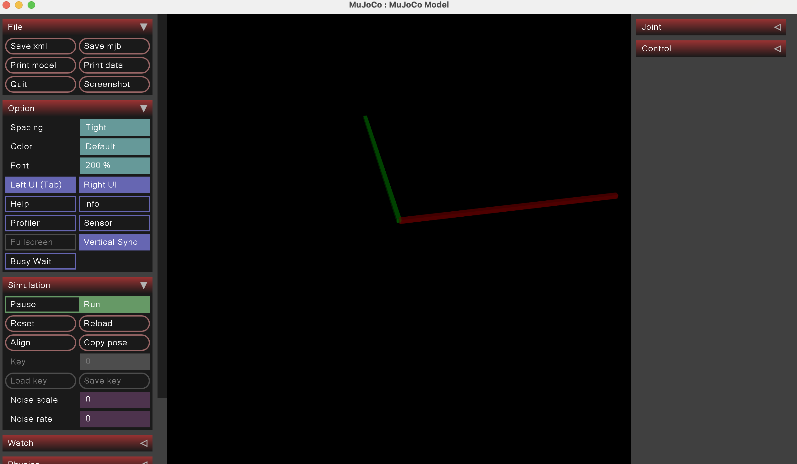
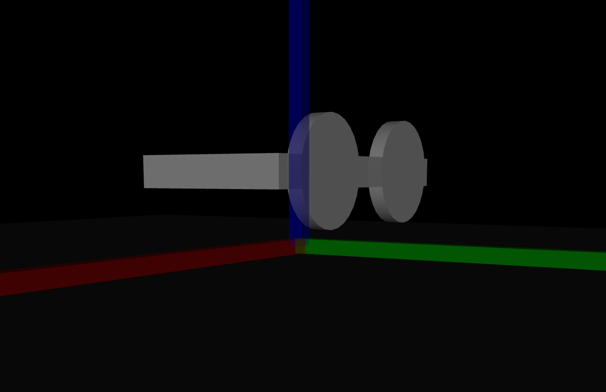
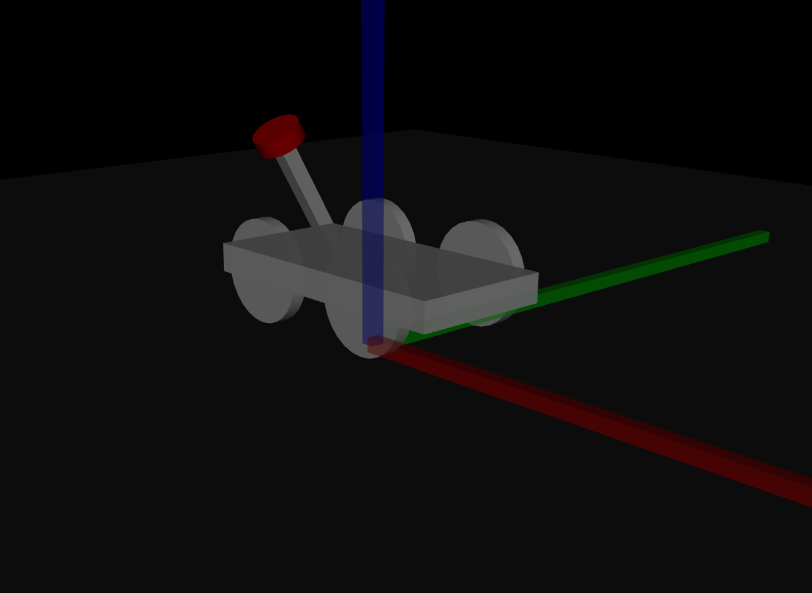

Todays lab is divided into two parts. First one concerns 3D transformations and will be conducted mostly on the blackboard. The second part happens in the MuJoCo simulator.

# 3D Transformations

## Basic transformations
1. Create a matrix M1 that rotates 3D space around the x axis by 90 degrees.
2. Create a matrix M2 that rotates 3D space around the y axis by 90 degrees.
3. Create a matrix M3 that translates 3D space by 1 unit along the x axis and then rotates it around the y axis by 90 degrees.

## Composition of transformations
4. Consider two multiplications: M1 * M2 and M2 * M1. Do you expect to get the same results? Check computationally if your predictions were correct.
5. Create a matrix M4 that rotates 3D space around the y axis by 90 degrees and then moves it by 1 unit along the x axis.
6. Consider two multiplications: M3 * M4 and M4 * M13. Do you expect to get the same results? Check computationally if your predictions were correct.
7. Create a matrix M5 that rotates a 3D space around the (1, 1, 0) vector by any given number of degrees.
_Hint:_ remember that sometimes it is easier to describe a transformation using different coordinates (e.g. choosing a different basis).
If you have such new coordinate system, then describing the transformation in original coordinates requires only finding the transformation between your two coordinate systems and then composing appropriate transformations in correct order.

## Different representations of transformations

Familirize yourself with the Rodrigues Formula: https://mathworld.wolfram.com/RodriguesRotationFormula.html.

8. Use the Rodrigues Formula to create a matrix M5 from the previous exercise. Compare the results and make sure they are the same.
9. Use the Rodrigues Formula to create a matrix M6 that rotates 3D space around the (1, 1, 1) vector by 90 degrees.

If you want to know more about Rodrigues Formula and how it is derived you can check out these videos: https://www.youtube.com/watch?v=UaK2q22mMEg and https://www.youtube.com/watch?v=q-ESzg03mQc.

10. We have the following rotation matrix:
```python
R = [[0.966496, -0.214612, 0.14081],
     [0.241415, 0.946393, -0.214612],
     [-0.0872034, 0.241415, 0.966496]]
```
What is the axis and the angle of rotation R? _Hint:_ consider a vector parallel to the axis of rotation. How the matrix R should act on this vector?
   
# MuJoCo (part two)

We are going to:
- build a car with wheels and a radar
- learn how to teleport the car to any position
- write a python program that creates a video of the car driving in a circle

## Coordinate frames

In this lab we are going to build a car with a radar. Let's start with the following XML file describing the world:


```xml
<?xml version="1.0" ?>
<mujoco>
    <worldbody>
         <body name="floor" pos="0 0 -0.1">
            <geom size="2.0 2.0 0.02" rgba="0.2 0.2 0.2 1" type="box"/>
        </body>
        <body name="x_arrow" pos="0.5 0 0">
            <geom size="0.5 0.01 0.01" rgba="1 0 0 0.5" type="box"/>
        </body>
        <body name="y_arrow" pos="0 0.5 0">
            <geom size="0.01 0.5 0.01" rgba="0 1 0 0.5" type="box"/>
        </body>
      
    </worldbody>
</mujoco>
```

You can view the world in MuJoCo simulator. You can also install mujoco `pip install mujoco`, and run:
```
python -m mujoco.viewer
```

And you should see something like this:



Now add the third arrow (it's a box, but let's call it arrow) for the z-axis.

Note, that the length of the arrow is not 0.5 but 1. This is because (https://mujoco.readthedocs.io/en/stable/XMLreference.html#body-geom) MuJoCo uses half-sizes for the box as stated in the documentation:

```
Three size parameters are required, corresponding to the half-sizes of the box along the X, Y and Z axes of the geom’s frame.
```

## Car body and wheels

We have a car with two deffects:
- first, one of the wheels is not rotated correctly,
- second, car has only two wheels, but we need four.

The car XML file looks like this:

```xml
<?xml version="1.0" ?>
<mujoco>
    <worldbody>

        <body name="x_arrow" pos="0.5 0 0">
            <geom size="0.5 0.01 0.01" rgba="1 0 0 0.5" type="box"/>
        </body>
        <body name="y_arrow" pos="0 0.5 0">
            <geom size="0.01 0.5 0.01" rgba="0 1 0 0.5" type="box"/>
        </body>
        <body name="z_arrow" pos="0 0 0.5">
            <geom size="0.01 0.01 0.5" rgba="0 0 1 0.5" type="box"/>
        </body>
        <body name="car" pos="0 0 0.1" axisangle="0 0 1 0">
            <geom size="0.2 0.1 0.02" rgba="1 1 1 0.9" type="box"/>
        </body>
        <body name="wheel_1" pos="0.1 0.1 0.1" axisangle="1 0 0 90">
            <geom size="0.07 0.01" rgba="1 1 1 0.9" type="cylinder"/>
        </body>
        <body name="wheel_2" pos="-0.1 0.1 0.1" axisangle="1 0 0 0">
            <geom size="0.07 0.01" rgba="1 1 1 0.9" type="cylinder"/>
        </body>
    </worldbody>
</mujoco>
```

What is wrong with `wheel_2`? It is not rotated correctly. The rotation is defined by the `axisangle` attribute with four numbers:
the first three numbers are the axis of rotation, and the last number is the angle of rotation.
The axis is defined in the local coordinate frame of the body. The angle is in degrees.
You can read more about it here: https://mujoco.readthedocs.io/en/stable/modeling.html#corientation

Rotate the wheel so that it is parallel to the ground.

Your result should look like this:



There are only two wheels and we need four. Add the other two wheels. Experiment with different positions and rotations, change the size of the wheels.

## Radar

The last step is to add a radar to the car. The radar is a box rotated 30 degrees about x axis with a red cylinder on top. 
In its default position the radar is pointing to the right, but we want it to point in any direction.
The final result could look like this:



You can take the following XML file as a reference:

```xml
<?xml version="1.0" ?>
<mujoco>
    <worldbody>
        <body name="floor" pos="0 0 -0.1">
            <geom size="2.0 2.0 0.02" rgba="0.2 0.2 0.2 1" type="box"/>
        </body>
        <body name="x_arrow" pos="0.5 0 0">
            <geom size="0.5 0.01 0.01" rgba="1 0 0 0.5" type="box"/>
        </body>
        <body name="y_arrow" pos="0 0.5 0">
            <geom size="0.01 0.5 0.01" rgba="0 1 0 0.5" type="box"/>
        </body>
        <body name="z_arrow" pos="0 0 0.5">
            <geom size="0.01 0.01 0.5" rgba="0 0 1 0.5" type="box"/>
        </body>
        <body name="car" pos="0 0 0.1" axisangle="0 0 1 0">
            <geom size="0.2 0.1 0.02" rgba="1 1 1 1" type="box"/>
        </body>
        <body name="wheel_1" pos="0.1 0.1 0.1" axisangle="1 0 0 90">
            <geom size="0.07 0.01" rgba="1 1 1 1" type="cylinder"/>
        </body>
        <body name="wheel_2" pos="-0.1 0.1 0.1" axisangle="1 0 0 90">
            <geom size="0.07 0.01" rgba="1 1 1 1" type="cylinder"/>
        </body>
        <body name="wheel_3" pos="0.1 -0.1 0.1" axisangle="1 0 0 90">
            <geom size="0.07 0.01" rgba="1 1 1 1" type="cylinder"/>
        </body>
        <body name="wheel_4" pos="-0.1 -0.1 0.1" axisangle="1 0 0 90">
            <geom size="0.07 0.01" rgba="1 1 1 1" type="cylinder"/>
        </body>
        <body name="radar_1" pos="0 -0.1 0.2" axisangle="1 0 0 30">
            <geom size="0.01 0.01 0.1" rgba="1 1 1 1" type="box"/>
        </body>
        <body name="radar_2" pos="0 -0.15 0.29" axisangle="1 0 0 30">
            <geom size="0.03 0.01" rgba="1 0 0 1" type="cylinder"/>
        </body>
    </worldbody>
</mujoco>
```

## Programming part 1

Write a python program, that can take four parameters:

- x position of the car
- y position of the car
- angle of the car (rotation clockwise along z axis)
- angle of the radar (rotation clockwise along z axis)

and creates the XML file for the car with the radar. The XML file should be saved as `car.xml`.

## Programming part 2

Resize (shrink) floor from 2x2 to 1x1 size.

Write a python program, that creates a video of a car starting at coordinates (-1,-1) pointing to (1, -1) driving in a circle with radius 1, finishing at point (0, 0). The radar should move around the car in the opposite direction.

You can use following code as an example of video creation:

```python
import mujoco
import matplotlib.pylab as plt


for i in range(10):
    xml = f"""
<mujoco>
  <visual>
     <global offwidth="1280" offheight="1280"/>
  </visual>
  <worldbody>
    <light name="top" pos="0 0 1"/>
    <geom name="red_box" type="box" size=".2 .2 .2" rgba="1 0 0 1"/>
    <geom name="green_sphere" pos="{.2 + i / 10} .2 .2" size=".1" rgba="0 1 0 1"/>
  </worldbody>
</mujoco>
"""
    model = mujoco.MjModel.from_xml_string(xml)
    data = mujoco.MjData(model)
    renderer = mujoco.Renderer(model, 1280, 1280)

    mujoco.mj_forward(model, data)
    renderer.update_scene(data)
    plt.imsave(f"frame_{i:03d}.png", renderer.render())
```

ffmpeg command to create a video:
```
ffmpeg -framerate 30 -pattern_type glob -i 'frame*.png' -c:v libx264 -pix_fmt yuv420p output.mp4
```
