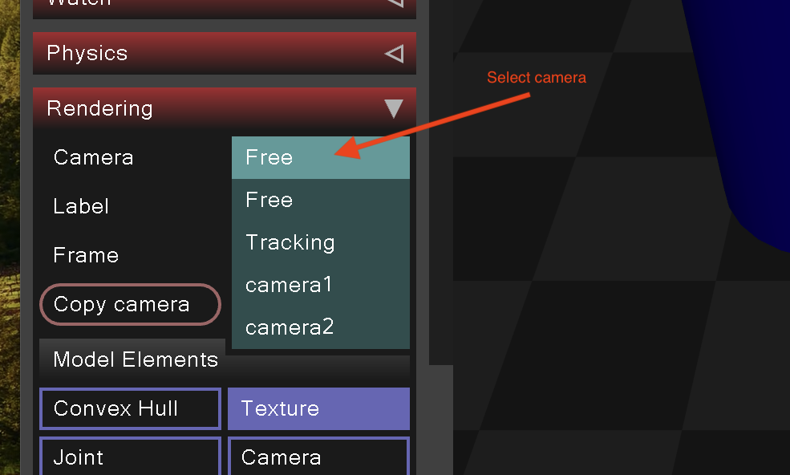
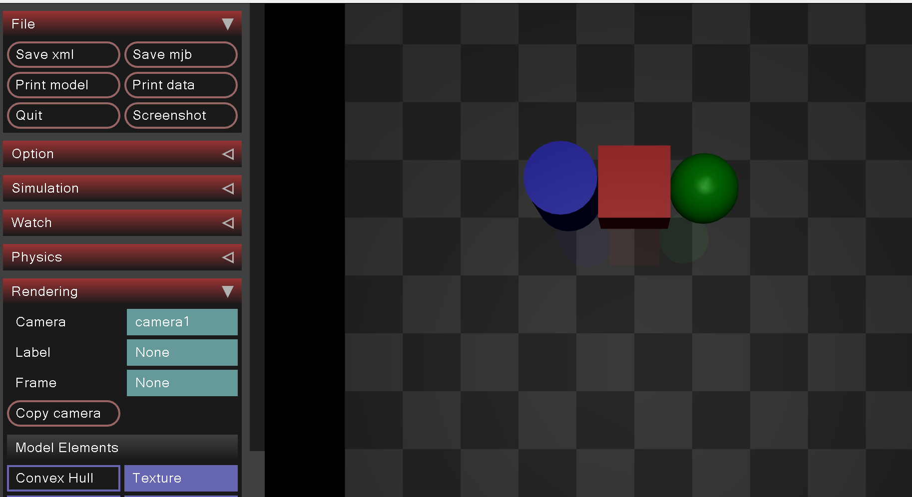
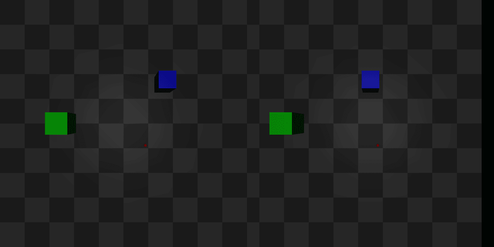

Todays lab contains of two parts. First in colab and second in MuJoCo simulator.

# Colab

Access the Colab notebook: [lab3-colab](lab3-colab-student.ipynb), additional resources are:

- [0.png](0.png)
- [1.png](1.png)
- [2.png](2.png)
- [3_left.png](3_left.png)
- [3_right.png](3_right.png)


download them from [here][https://github.com/mim-uw/rc-2023-24/tree/master/docs/lab3-public] and upload them to your
colab.


# MuJoCo

For this part, you'll be working with the following MuJoCo XML world:


```xml
<mujoco model="simple_scene">
    <option timestep="0.005" gravity="0 0 -9.81"/>

    <asset>
        <texture name="plane_texture" type="2d" builtin="checker" rgb1="0.2 0.2 0.2" rgb2="0.3 0.3 0.3" width="512" height="512"/>
        <material name="plane_material" texture="plane_texture" texrepeat="5 5" reflectance="0"/>
    </asset>

    <worldbody>
        <geom type="plane" size="1 1 0.1" material="plane_material"/>

        <body pos="0 0 0.5">
            <geom type="box" size="0.1 0.1 0.1" rgba="0.8 0 0 1"/>
        </body>

        <body pos="0.2 0 0.5">
            <geom type="sphere" size="0.1" rgba="0 0.8 0 1"/>
        </body>

        <body pos="-0.2 0 0.5">
            <geom type="cylinder" size="0.1 0.15" rgba="0 0 0.8 1"/>
        </body>

        <!-- Cameras -->
        <camera name="camera1" pos="0 -0.1 1" fovy="90"/>
        <camera name="camera2" pos="0 0.1 1" fovy="90"/>
    </worldbody>
</mujoco>
```

This XML code defines a simple scene with a plane, a box, a sphere, a cylinder, and two cameras. Familiarize yourself with the XML structure and understand the role of each element.

## Visualizing the Scene:

Open the MuJoCo simulator to view the scene. Pay attention to the XML structure and how each element contributes to the visual scene. Also, note that two cameras ("camera1" and "camera2") are specified in the XML.



The image above demonstrates how you can select the desired camera view within the simulator. Below is the view from "camera1":



## Tasks

1. **Camera Rotation**: Modify the XML to rotate the camera. Refer to the [MuJoCo documentation on cameras](https://mujoco.readthedocs.io/en/stable/XMLreference.html#body-camera) for guidance. Do it just to see how it works. Also try to change fovx and fovy to see how it affects the image.
2. **Add a small red ball**: add small red ball (so small that it is just visible from the camera) to the scene and change the color of the red box to something else, so that you can distinguish between the red ball and everything else in the world.
3. **Object detection**: write a code that finds the position of the center of the red ball in a picture (cols, rows). You can use the following code to generate pictures from mujoco camera and test your solution:

```python
import mujoco
from PIL import Image

xml_path = "a.xml"
model = mujoco.MjModel.from_xml_string(open(xml_path).read())
renderer = mujoco.Renderer(model, 1024, 1024)
data = mujoco.MjData(model)
mujoco.mj_forward(model, data)
renderer.update_scene(data, camera="camera1")
img = Image.fromarray(renderer.render())
img.save("red_ball.png")
```

4. **Stereo Matching**: Your task is to implement your own depth detection using stereo matching. In mujoco/ you are presented with 3 files: reconstruct.py, left.png and right.png. reconstruct.py was used to
   generate the world (two boxes and one sphere) as seen from two cameras (left.png, right.png) but the information about the positions of the objects was lost. Using the information about positions of the cameras, sizes
   of the objects and your knowledge about relationship between disparity and baseline, find the coordinates of the
   objects. Finish the implementation of reconstruct.py to reconstruct the scenes from left.png and right.py. The objects should be in very similar position, but don't worry if they are not exactly the same.



