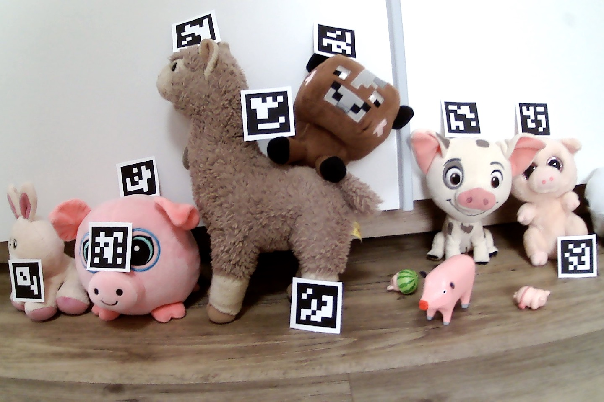

# Updates

Not yet

# Submission format

**The submission deadline is Dec 4 (Monday), 8:00am 2023.**
 
You should submit via moodle:
* created panoramas (Task 5 and Task 7),
* source code and instruction how to run the code.

# Task description

In this assignment, you should make a panorama of three photos. The method you will be using is called image stitching and it was described during Lecture 4 (you can access slides and recording on moodle).

You are given 6 photos (attached at the bottom). The photos are taken with the same camera that was used during the 4th lab session. There are aruco.DICT_6X6_250 tags on the photos, which you can use to find the correct sequence of photos.

Although there are multiple implementations of image stitching using different libraries (OpenCV, skimage, ...) you should implement the method using only `numpy` for computations and `matplotlib` or `cv2` for displaying images.

You should also write your implementation of projective transformation fitting and of RANSAC (using `numpy` and `random`). Undistortion should be done using `cv2` library.

## Task 1 (1 point)

Undistort the photos. Write a function that finds ArUcO tags on the photos and returns their coordinates. Use those coordinates to find correct sequence of images. Your program should run correctly on any subset of three out of six photos.

**Note:** It is enough to generate undistorted images without any extra added (black) pixels,
i.e. you can use `alpha=0` in
[cv2.getOptimalNewCameraMatrix()](https://docs.opencv.org/4.6.0/d9/d0c/group__calib3d.html#ga7a6c4e032c97f03ba747966e6ad862b1).

Make sure (by verifying if straight line appear straight) that your undistorted images aren't worse than originals!

## Task 2 (1 point)

As you remember from the lecture, one of the most important steps in image stitching is projecting all images on a common plane - this allows us to merge them into one picture.

That's why your first task is to write a function, that takes image and projective transformation matrix, applies projective transformation to the image and displays both the original image and the transformed image.

You can implement the function by taking each pixel from the *destination* image and map it to a single pixel in the *source* image (by using the inverse homography). 
It is enough to use a nearest neighbor to find a pixel in the *source* image, it is not required to interpolate between the neighboring pixels.
You can implement it by using loops, no need to vectorize your solution.

Note:
* if you use forward homography only (potentially leaving holes in the destination image) you will get -0.5 points,
* if you don't implement nearest neighbor but rather rounding coordinates always down you get -0.25 points.


## Task 3 (3 points)

Using `linalg.svd` write a function that finds a projective transformation based on a sequence of matching point coordinates.
As described during the lecture this can be done by casting the problem as an instance of the 
constrained least squares problem, i.e., given `A` find `x` such that the squared norm of `Ax` is minimized
while having `x` a unit vector.
Check slides from Lecture 3 for a solution to this problem by finding the 
Eigenvector corresponding to the smallest eigenvalue of the matrix `transpose(A) * A`.
In practice it is actually good to exploit the structure of `transpose(A) * A` to find its eigenvectors. Therefore, instead of using the general `linalg.eig` on the `transpose(A) * A` matrix, one can use `linalg.svd` on the `A` matrix and determine the smallest eigenvector of `transpose(A) * A` from singular value decomposition of `A`. Here's a code snippet which performs this operation (you can use it in your solution):

```
_, _, V = np.linalg.svd(A)
eingenvector = V[-1, :]
```

Note: it is required to write tests to your method (otherwise you lose 1 point). 
The test should pick a random homography, compute the matching pairs based
on this homography and check that the implemented method recovers it (and repeat it several times).


## Task 4 (1 point)

Find 2D coordinates of a few points that are visible on both photos by hand.
Coordinates should be quite accurate — up to a single pixel.
You can do this for example by displaying an image in `cv2.imshow()` or `plt.imshow()`
and zooming in so that single pixels are big enough to distinguish their coordinates.


Using those coordinates as a ground truth find a projective transformation between the right and the left photo using results of the previous task.

## Task 5 (3 points)

Using the projective transformation you have already found, stitch two photos into one.
For the overlapping area use a weighted average of pixels (smoothing as described during the lecture) where the weights are proportional to the distance 
from the center of the image a pixel originates from (it is up to you to decide on the exact metric that defines the distance from the image center).

Note:
* for not using weighted average you will lose 1 point,
* for not finding the full stiched image but rather some cropped version, you will lose 1 point.

Sample panorama without weighted average:


Sample panorama with weighted average:


## Task 6 (1 point)

So far we have matched points on two photos by hand. We would like to automate this process.

Use positions of the markers in order to find matching points on different photos automatically.

## Task 7 (2 points)

Some of the matches may be incorrect. Get rid of those matches using RANSAC with projective transformation.

Make two panoramas from two subsets of three photos (like in Task 5) using an automatic matching method.
First subset should be photos (`hw11.jpg`, `hw12.jpg`, `hw13.jpg`), second subset should be photos (`hw11.jpg`, `hw14.jpg`, `hw13.jpg`). The second one is tricky.


# Images


