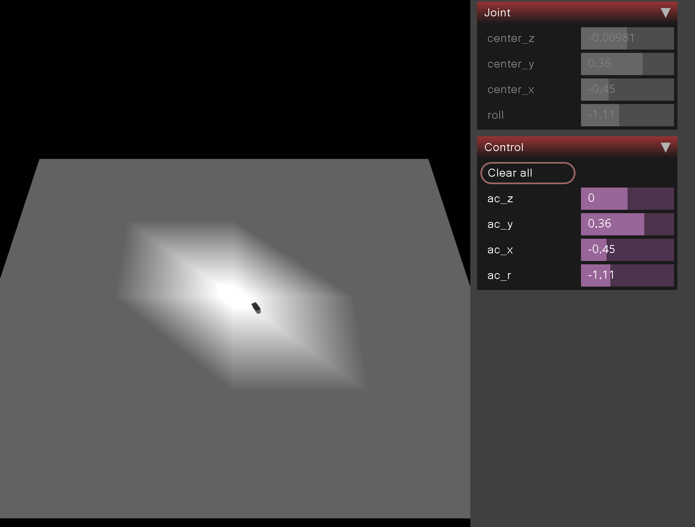
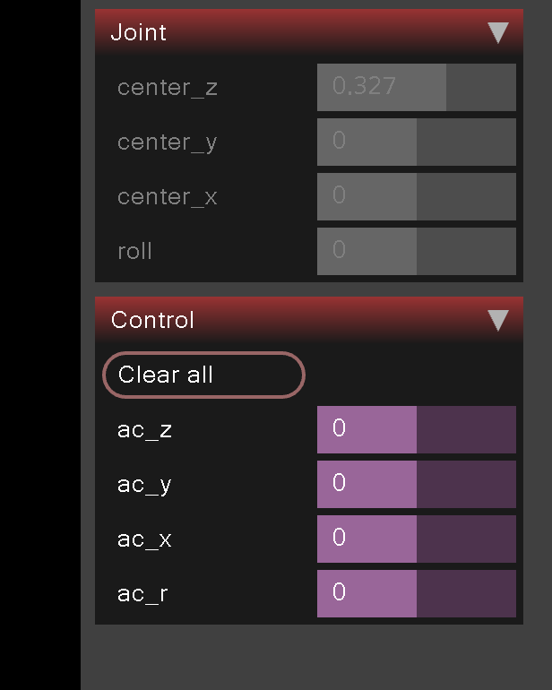

# Goals

The main goals of this lab:

- learn a bit about MuJoCo
- control robot from python


# Steps

1. Run MuJoCo with a gripper
2. Run MuJoCo with a gripper and a cube
3. Run MuJoCo with a gripper and a cube and control the gripper from python
4. Write a MuJoCo game
5. Write a program that can win your game

## Step 1

Let's start with the following MuJoCo model:

```xml
<mujoco model="robot">
  <option timestep="0.001" gravity="0 0 -9.81"/>
  <compiler autolimits="true"/>
  <worldbody>
    <light name="top" pos="0 0 1"/>
    <body name="floor" pos="0 0 -0.1">
      <geom size="5.0 5.0 0.02" rgba="1 1 1 1" type="box"/>
    </body>
    <body name="griper">
       <inertial pos="0 0 0" mass="0.001" diaginertia="0.001 0.001 0.001"/>
      <joint name="center_z" pos="0 0 0" damping="0.5" axis="0 0 1" type="slide" range="-1.1 1.1"/>
      <joint name="center_y" pos="0 0 0" damping="0.5" axis="0 -1 0" type="slide" range="-1.1 1.1"/>
      <joint name="center_x" pos="0 0 0" damping="0.5" axis="-1 0 0" type="slide" range="-1.1 1.1"/>
      <joint name="roll" pos="0 0 0" damping="0.5" axis="0 0 1" type="hinge" range="-360 360"/>
      <geom size="0.1 0.05 0.01" type="box" rgba="0.356 0.361 0.376 1"/>
     </body>
  </worldbody>
  <actuator>
    <position name="ac_z" joint="center_z" />
    <position name="ac_y" joint="center_y" />
    <position name="ac_x" joint="center_x" />
    <position name="ac_r" joint="roll" ctrlrange="-3 3" />
  </actuator>
</mujoco>
```

If we run it with a viewer we should see something like this:



On the right you can see controls and position of the gripper. Try to move the gripper around and observe how the controls change.



Our actuators are `ac_z`, `ac_y`, `ac_x` and `ac_r`. They are connected to joints `center_z`, `center_y`, `center_x` and `roll` respectively.
The controlled values are positions of the joints and an angle of the `roll` joint. It's uncommon. Usually, we would control velocity or acceleration of the joints.

Just to try why controlling position is simpler, let's try to control velocity of the `center_z` joint. We can do it by changing the actuator type to `velocity`.

```xml
<velocity name="ac_z" joint="center_z">
```

If you will do it, than you will see that a gripper in the air is moving down, although the control is set to 0. This is because the gravity is pulling the gripper down and we are not compensating for it. Try to compensate for it by setting the control to the opposite value of the gravity. It's hard to keep a gripper in place, right? Let's go back to controlling position.

```xml
<position name="ac_z" joint="center_z" />
```

Maybe there is a bug in the xml, that switches directions of the axes, try to find it and fix it.

## Step 2

Add a cube to the model:
```xml
<body name="box1" pos="0.3 0 0.5">
    <joint name="box1-joint" type="free"/>
    <geom size="0.1 0.1 0.1" rgba="1 0 0 1" type="box"/>
    <inertial pos="0 0 0" mass="0.001" diaginertia="0.001 0.001 0.001"/>
</body>
```

The cube, although much bigger than the gripper, is quite light. It's mass is only 1 gram. Try to move the cube using the gripper. You will see that it's possible.

Also try to rotate the cube. It's a little bit harder, but still possible. Maybe the good idea is to rotate the gripper first and then move it to the cube?


# Step 3

Ok, now it's time to control the robot from python. We will use following code for that:

```python
import mujoco
import numpy as np
from mujoco import viewer
import time

model = mujoco.MjModel.from_xml_path("robot.xml")
data = mujoco.MjData(model)

viewer = viewer.launch_passive(model, data)

step = 0
while True:
    step_start = time.time()
    step += 1

    if step % 1000 == 0:
        data.actuator("ac_x").ctrl = np.random.uniform(-1.1, 1.1)
        data.actuator("ac_y").ctrl = np.random.uniform(-1.1, 1.1)
        data.actuator("ac_z").ctrl = np.random.uniform(-1.1, 1.1)
        data.actuator("ac_r").ctrl = np.random.uniform(-3, 3)
        print(data.joint("box1-joint").qpos)
    mujoco.mj_step(model, data)
    viewer.sync()
    time_until_next_step = model.opt.timestep - (time.time() - step_start)
    if time_until_next_step > 0:
        time.sleep(time_until_next_step)
```

Multiple things are happening in the code, so let's go through it step by step.

Here we create a model and data for it. We also create a viewer. The viewer is used to display the scene in a window. We could also create a renderer and render the scene to a file, but we will not do it in this lab.

```python
model = mujoco.MjModel.from_xml_path("robot.xml")
data = mujoco.MjData(model)
mujoco.mj_forward(model, data)

viewer = viewer.launch_passive(model, data)
```

Now the main loop starts. We will run it forever, but you can stop it by pressing `Ctrl+C`.

We set desired positions of the joints to random values. We also print current position of the cube. Please note that position consists of seven numbers. First three numbers
are position of the cube in the world coordinates. The next four numbers are quaternion that describes rotation of the cube. We will not use quaternions directly in this lab, but you can read about them [here](https://en.wikipedia.org/wiki/Quaternion).

```python
data.actuator("ac_x").ctrl = np.random.uniform(-1.1, 1.1)
data.actuator("ac_y").ctrl = np.random.uniform(-1.1, 1.1)
data.actuator("ac_z").ctrl = np.random.uniform(-1.1, 1.1)
data.actuator("ac_r").ctrl = np.random.uniform(-3, 3)
print(data.joint("box1-joint").qpos)
```

The last part is a small trick:

```python
time_until_next_step = model.opt.timestep - (time.time() - step_start)
if time_until_next_step > 0:
    time.sleep(time_until_next_step)
```

Without the last part the simulation would run as fast as possible. We want to run it with a fixed frequency, so we need to wait a little bit before running the next step. We can do it by calling `time.sleep` function. We calculate how much time we need to sleep by subtracting time of the current step from the time of the next step. If the result is negative, than we don't need to sleep at all.

```xml
timestep="0.001" 
```

from the model tells how many frames simulation should run per second. In this case it's 1000 frames per second, so we need to sleep for about 0.001 seconds between steps.

# Step 4

Add four cubes in random places (using `random` and modyfing xml) within the reach of the robot. Write a game with the goal of getting all the cubes close to the (x=0, y=0, z=?) point. Allow user to control the robot with sliders (maybe via a keyboard?).

# Step 5

Write a program that can win your game. Try to find two different methods:

- one that moves the cubes one by one to the goal, looking at the cube's positions (qpos),
- second that always wins, no matter where the cubes are, without looking at the cube's positions,

# Step 6 (hard - optional)

Replace the cubes with balls. Write a program that can win your game.